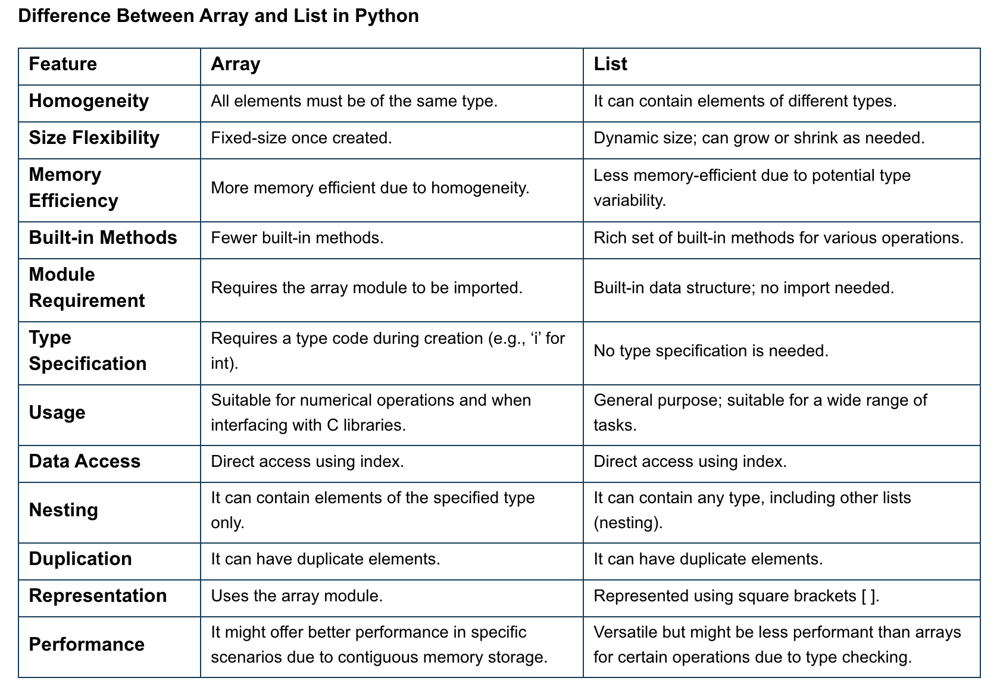

### Checkpoint : [python] !
## 1.
> Lists and Tuples in Python are two classes of Python Data Structures.  
 The ==list structure is dynamic==, and readily changed whereas the ==tuple structure== is static and cannot be changed. This means that the tuple is generally faster than the list. Lists are denoted by square brackets and tuples are denoted with parenthesis

 #### list_syntax = [ ];
 #### tuples_syntax = ( );
 List = [1, 2, 4, 4, 3, 3, 3, 6, 5]

 #### Both lists and tuples allow you to access individual elements using their index, starting from 0.
- tuples = (0, 1, 2, 3)
- tuples[0] = 4
-print(List[0])

___
## 2.
### A namespace in Python is : 
 a container that holds a set of identifiers (names) and their corresponding objects. It ensures that names are unique and can be used without conflicts.
- In a Python program, there are four types of namespaces:

1. Built-In
1. Global
1. Enclosing
1. Local

___
## 3.
### What is a Local Variable?
Local variables are variables that are defined inside a function. They can only be accessed within that function. These variables are created when the function is called and are destroyed when the function returns.
In simple terms, local variables can’t be modified outside the defined function, and its existence starts when the function is called and ends when the function completes its execution.

### What is a Global Variable?
A global variable in Python is a variable that is defined outside of any function. It can be accessed from anywhere in the program. These variables help store the data that needs to be accessed throughout the program. But, generally, it is considered to avoid using global variables whenever possible. This is because global variables can make your code more difficult to read and maintain.

|Advantages of Local Variable|	Disadvantages of Local Variable|
|---|---|
|Limited to the function or block, reducing chances of accidental modification from other parts of the code. | Cannot be accessed outside its function or block, which might require passing it as an argument if needed elsewhere.|
|Memory is efficiently managed as the variable is destroyed once the function completes its execution. | Might lead to redundancy if similar local variables are declared in multiple functions.|
|Reduced risk of naming conflicts with variables from other functions or global variables. | Ensure unique naming within the function to avoid conflicts with other local variables.|
___
## 4.
### What is an IDE?
- An IDE enables programmers to combine the different aspects of writing a computer program.
- IDEs increase programmer productivity by introducing features like editing source code, building executables, and debugging.

> Code editors are generally simpler than IDEs, as they ==do not include many other IDE components==. As such, code editors are typically used by experienced developers who prefer to configure their development environment manually.

### Top python IDEs :
1. IDLE : IDLE (Integrated Development and Learning Environment) is a default editor that accompanies Python,this IDE is suitable for beginner-level developers.
1. PyCharm: PyCharm is a widely used Python IDE created by JetBrains, this IDE is suitable for professional developers and facilitates the development of large Python projects.
1. Visual Studio Code: is an open-source (and free) IDE created by Microsoft. It finds great use in Python development.VS Code is lightweight and comes with powerful features that only some of the paid IDEs offer

___
## 5.
> Modules enable you to split parts of your program in different files for easier maintenance and better performance.

 ####  A module is a file consisting of Python code. It can define functions, classes, and variables, and can also include runnable code. Any Python file can be referenced as a module. A file containing Python code, for example: test.py, is called a module, and its name would be test.
 ### when to use modules ? 
 As your program grows more in the size you may want to split it into several files for easier maintenance as well as reusability of the code. The solution to this is Modules. You can define your most used functions in a module and import it, instead of copying their definitions into different programs. A module can be imported by another program to make use of its functionality. This is how you can use the Python standard library as well.

 ___
 ## 6.
 Array and list are data structures in Python that are used to store the data in a specific order. Arrays are useful for storing data that needs to be accessed in a specific order, such as a list of student names or a sequence of numbers, while lists are mutable, meaning that they can be changed after they are created
 

 Why Choose One Over the Other?
Scenario 1: Building a Digital Music Library
Problem: You’re building a digital music library where you need to store thousands of songs’ duration (in seconds).

Array: Given that all song durations are integers (e.g., 180 seconds, 240 seconds), an array would be a suitable choice. It ensures that all elements are of the same type (integers) and offers memory efficiency.
List: While a list can also store the song durations, it might consume more memory due to its flexibility to store mixed data types.
Verdict: An array would be more apt in this scenario due to its memory efficiency and type consistency.
___
## 7. 
Python divides the operators in the following groups:

- Arithmetic operators
- Assignment operators
- Comparison operators
- Logical operators
- Identity operators
- Membership operators
- Bitwise operators